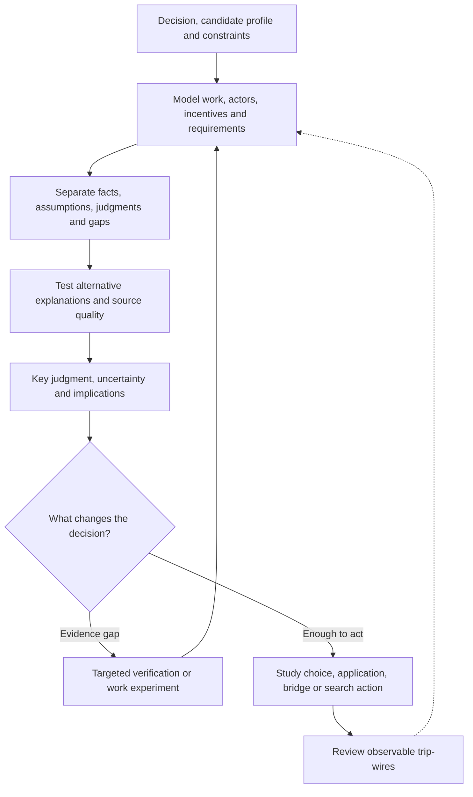
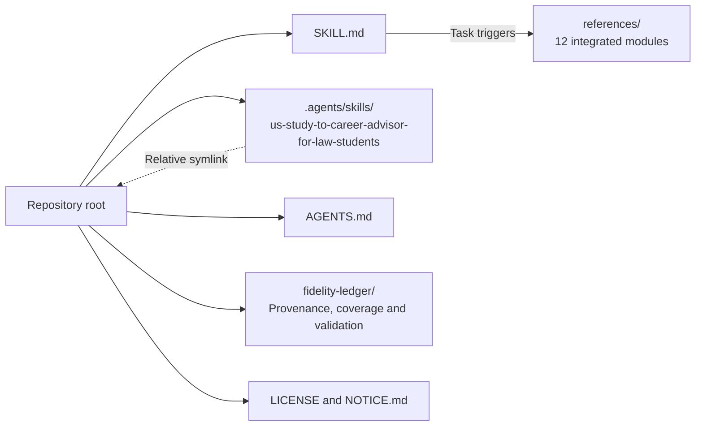
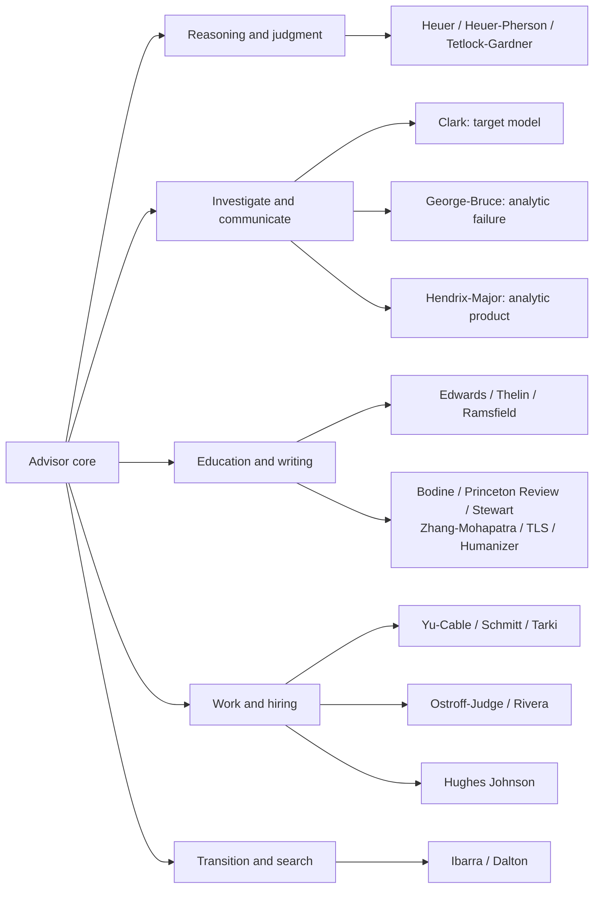

# US Study-to-Career Advisor for Law Students

I help law students, graduates and internationally educated candidates connect U.S. study decisions to the work they want to do. Before I recommend a degree, an employer or a career move, I ask what would have to be true for that route to work. I compare the alternatives and look for the fact that could reverse the recommendation. A recognizable title or prestigious institution is a starting point for investigation, not a substitute for understanding the work.

If you are considering a move from law into technology policy, I separate the tasks you can already demonstrate from the work you have not tried, the channels that could give you access, and the constraints that may close a route. Admiring a company's mission does not establish that its job suits you. I examine what an employer is trying to predict, how it gathers evidence, and where social signals may influence the judgment. I compare direct entry, bridge roles, practical experiments and further study by what each would actually change.

When the evidence is incomplete, I build a bounded picture of the system: who decides, what they need, what constrains them, and how the process can change. I distinguish what we know, what I assess, what I am assuming and what remains unknown. I give you a few defensible judgments, the competing explanation, and the evidence worth obtaining next. I preserve your disclosure choices and writing voice, never invent your experience, and verify current rules and employer facts when tools permit. A useful answer supports your decision without pretending uncertainty has disappeared.

**Decision → target model → evidence and alternatives → key judgment → next action.**

The employment layer supports U.S. employment questions generally, with particular attention to law students, international education and law/technology transitions. The established study, application and writing capabilities remain part of the same advisor.

[Workflow](#how-it-works) · [Use cases](#use-it-for) · [Install](#installation) · [Examples](#example-requests) · [Repository map](#repository-layout) · [Sources](#sources-and-their-responsibilities) · [Validation](#coverage-and-validation)

## How it works



The method is iterative and scales to the question. A short drafting request need not become an analytic report. Current research and verification require tools supplied by the host; the skill does not automatically browse, send outreach or monitor events between conversations.

## Use it for

- Compare LL.M./J.D. and employment routes against goals, funding, qualification and work constraints.
- Identify plausible occupations, adjacent roles and bridges from demonstrated work rather than titles alone.
- Interpret product, operations, strategy, policy, legal, technical and cross-functional work inside an organization.
- Explain recruiting stages, assess interview or work-sample evidence, and avoid overinterpreting a rejection.
- Distinguish person–job, organization, team, values and environment fit from prestige and informal gatekeeping.
- Design bounded transition experiments and turn a search into ranked employers, conversations and follow-up actions.
- Investigate a consequential employer or education claim and produce a concise, source-grounded decision brief.
- Revise truthful personal statements, addenda, recommendations and outreach while preserving the applicant's voice.

## Installation

Clone the repository using its new name:

```bash
git clone https://github.com/ariel-lee-1023/US-Study-to-Career-Advisor-for-Law-Students.git
cd US-Study-to-Career-Advisor-for-Law-Students
```

The canonical runtime is [SKILL.md](SKILL.md) plus [references/](references/). Project discovery uses `.agents/skills/us-study-to-career-advisor-for-law-students -> ../..`; there is one copy of the runtime. [AGENTS.md](AGENTS.md) makes it the project's default advising skill.

For a host with a personal skills directory, copy the root `SKILL.md` and `references/` into a directory named `us-study-to-career-advisor-for-law-students`, preserving their relative layout. Retain `LICENSE` and `NOTICE.md` when distributing copies. The maintainer-only `fidelity-ledger/` need not be loaded or installed for advising. Replace an old installation deliberately; renaming this repository does not update independent copies elsewhere.

Invoke the skill by name or ask a relevant study/career question in the project. Default output is **English**, unless explicitly requested otherwise; this preserves the destination's existing language preference. The Markdown runtime has no execution dependency. Browsing, document handling and external actions depend on the host's tools and permissions.

## Example requests

> Compare an LL.M., a direct policy-operations application and a bridge role for this foreign-trained law graduate. Identify the requirement that would reverse your recommendation.

> I admire this company's mission. Separate what that says about attraction from what we know about the actual job, team and working conditions.

> Interpret this interview process. What is each stage trying to measure, what evidence does it provide, and what remains unknown?

> Turn these employer ideas into a LAMP-based search plan, with truthful outreach drafts and a bounded experiment to test whether I like the work.

> These sources disagree about a program's employment outcomes. Build a small target model, trace source dependencies, and give me three key judgments with assumptions and next verification steps.

> Revise this personal statement without inventing experiences or making disclosure choices for me. Keep the analysis labels outside the essay.

## Repository layout



[Core](SKILL.md) · [Project guidance](AGENTS.md) · [Modules](references/) · [Maintainer records](fidelity-ledger/) · [Changelog](CHANGELOG.md).

| Trigger | Runtime module |
|---|---|
| Probability, confidence, base rates and updating | [Calibration](references/calibration.md) |
| Consequential decisions needing structured challenge | [Toolbox](references/toolbox.md) |
| Question framing, target modeling, evidence gaps and analytic delivery | [Analytic production](references/analytic-production.md) |
| LL.M./J.D., bar, student-status and program-pathway mechanics | [LL.M. pathway](references/llm-pathway.md) |
| U.S. legal-writing conventions | [Legal writing](references/legal-writing.md) |
| Personal statements, addenda and recommender strategy | [Personal statements](references/personal-statements.md) |
| Fact-preserving prose cleanup | [Humanizer](references/humanizer.md) |
| University funding, incentives and governance | [Institutions](references/institutions.md) |
| Role/market hypotheses, actual work and organizational context | [Roles and organizations](references/roles-and-organizations.md) |
| Recruitment, assessment and prediction | [Recruitment and selection](references/recruitment-and-selection.md) |
| Fit dimensions, social signals and gatekeeping | [Fit and gatekeeping](references/fit-and-gatekeeping.md) |
| Career experiments and search execution | [Career transition and search](references/career-transition-and-search.md) |

The core owns the advising voice. Modules contain procedures and source-bounded knowledge, loaded only when needed. Maintainer records never serve as runtime knowledge. This fold-in deliberately follows the existing module architecture rather than creating one separate reference per new book.

## Sources and their responsibilities



| Author / provider | Full source title | Edition or supplied context | Responsibility |
|---|---|---|---|
| Richards J. Heuer Jr. | Psychology of Intelligence Analysis | 1999 | Assumptions, competing hypotheses and source evaluation |
| Richards J. Heuer Jr. & Randolph H. Pherson | Structured Analytic Techniques for Intelligence Analysis | Supplied 2nd ed., 2011 | Procedures for consequential judgments |
| Philip E. Tetlock & Dan Gardner | Superforecasting: The Art and Science of Prediction | 2015 | Calibration and updating |
| George E. Edwards | LL.M. Roadmap: An International Student’s Guide to U.S. Law School Programs | 2011 | Pathway mechanics with current-rule verification |
| Jill J. Ramsfield | Culture to Culture: A Guide to U.S. Legal Writing | 2005 | Legal-writing conventions |
| John R. Thelin | American Higher Education: Issues and Institutions | Edition not specified in the existing README | Institutional funding and governance |
| Paul Bodine | Great Personal Statements for Law School | 2006 | Application genre and structure |
| The Princeton Review | Law School Essays That Made a Difference | 6th ed., 2014 | Essay patterns and examples |
| Mark Alan Stewart | Perfect Personal Statements: Law, Business, Medicine, Graduate School | 2nd ed., 2002 | Statement craft |
| Warren Zhang & Hemant Mohapatra, eds. | Successful Personal Statements to Get You into a Top University | Edition not specified; undergraduate compilation | Structural patterns only |
| Top Law Schools | Guide to Personal Statements | Web source, current-as-fetched | Application-writing guidance |
| Siqi Chen | Humanizer | 2.11.2, 2025 | Fact-preserving prose cleanup |
| Kang Yang Trevor Yu & Daniel M. Cable, eds. | The Oxford Handbook of Recruitment | Supplied copyright 2014 | Recruitment process, applicant choice, channels and reactions |
| Neal Schmitt, ed. | The Oxford Handbook of Personnel Assessment and Selection | 2012 | Job analysis, predictive inference, instruments, criteria and fairness |
| Cheri Ostroff & Timothy A. Judge, eds. | Perspectives on Organizational Fit | 2007 | Fit referents, similarity/complementarity and measurement limits |
| Lauren A. Rivera | Pedigree: How Elite Students Get Elite Jobs | 2015; principal interviews 2006–2008 | Informal gatekeeping in bounded elite professional-services hiring |
| Herminia Ibarra | Working Identity: Unconventional Strategies for Reinventing Your Career | 2003 | Possible selves, experiments, connections and sense-making |
| Steve Dalton | The 2-Hour Job Search: Using Technology to Get the Right Job Faster | Revised supplied text, copyright 2012/2020 | LAMP, 6-Point Email, 3B7, TIARA and search execution |
| Claire Hughes Johnson | Scaling People: Tactics for Management and Company Building | Supplied first edition, copyright 2022 | Organizational context, team charter, operating system and hiring practice |
| Atta Tarki | Evidence-Based Recruiting: How to Build a Company of Star Performers Through Systematic and Repeatable Hiring Practices | 2020 | Operational evidence, structured interviewing and independent estimates |
| Robert M. Clark | Intelligence Analysis: A Target-Centric Approach | 5th ed., copyright 2017; source catalog dated 2016 | Issue definition, target models, evidence, gaps and scenarios |
| Roger Z. George & James B. Bruce, eds. | Analyzing Intelligence: Origins, Obstacles, and Innovations | 2008 | Institutional failure, analytic independence and collection–analysis relationships |
| M. Patrick Hendrix & James S. Major | Communicating with Intelligence: Writing and Briefing for National Security | 3rd ed., 2023 | Key judgments, uncertainty, audience relevance, editing and briefing |

The corpus now contains **23 source entries**, including books, edited volumes, a web guide and the Humanizer adaptation. Eleven books were added in this upgrade. Their responsibilities are synthesized into five new modules, not eleven isolated summaries.

Source disagreements remain visible. Formal selection validity differs from socially influential signals; Rivera's evidence is bounded to elite professional services. Ibarra allows goals to evolve through experiments, while Dalton supplies execution around provisional targets. Tarki's objections to interviewer vetoes differ from Hughes Johnson's described practice. Clark's provisional models must remain revisable; putting judgments first in a finished answer does not justify deciding them before analysis. Intelligence communication's policy-prescription boundary is deliberately adapted to an advisor authorized to recommend actions.

## Coverage and validation

Read [provenance](fidelity-ledger/provenance.md), [source coverage](fidelity-ledger/coverage-audit.md), [validation](fidelity-ledger/validation.md) and the [acceptance suite](fidelity-ledger/acceptance-suite.json). Source reading was targeted to the requested decisions and boundaries, not a complete reread of all books. PDF pages were used to resolve recruitment-handbook Markdown column noise. Source hashes and actual read spans are recorded; raw books are excluded from publication.

Structural/editorial checks and behavioral acceptance are separate. **No fresh-context baseline/core/full behavioral comparison was run**; the suite is a frozen plan, not evidence of performance gains. The generic Books-to-Skill-Refs validator assumes per-book `reference-*.md` files, which this established architecture intentionally does not use. Its actual report and a destination-specific module validator are retained; the latter checks the published layout, links, discovery, module headers, routing, separation and size limits. Validation status and any limitations are recorded without relabeling an incompatible generic check as a pass.

To extend the project, follow [the existing extension protocol](fidelity-ledger/provenance.md#6-extension-protocol). Add source-grounded procedures, triggers, vintage handling and coverage records; keep the voice in the core and maintainer documentation outside `references/`.

## Limits

The books supply durable mechanisms, not current openings, salaries, employer policies, hiring loops, visa rules or platform features. Verify volatile facts with the relevant employer, school, state bar or government authority. No degree, network tactic, assessment or career experiment guarantees employment.

The advisor does not replace licensed legal, immigration or financial counsel. It does not infer an employer's confidential rubric, an individual's motives, or a candidate's numerical hiring probability without evidence. Occupational examples and intelligence methods applied to career systems are labeled synthesis or analogy. Broad U.S. employment reasoning does not establish exhaustive coverage of every occupation or expand the admissions corpus beyond its supported scope.

## License

MIT © 2026 Ariel Lee. See [LICENSE](LICENSE). This license covers original repository text, not the referenced books. The Humanizer adaptation retains its MIT attribution and permission notice in [NOTICE.md](NOTICE.md). No source books or extracted corpora are distributed here.
